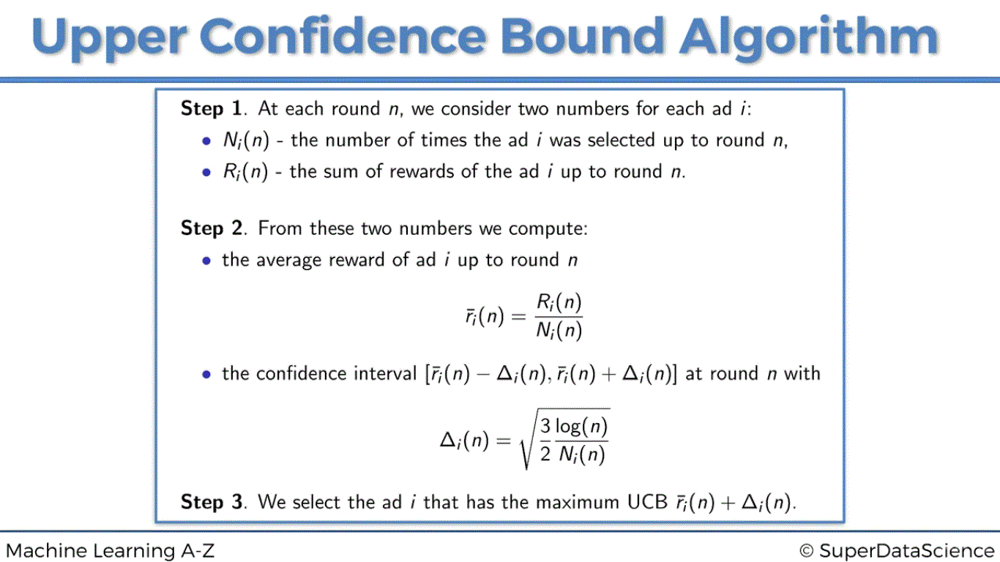

# Upper Confidence Bound Optimisation for Reinforcement Learning

This is an example of CTR (click-through rate) optimisation. 

Each column in the dataset corresponds to a version of an advert. Each row represents a user that has been shown versions of the advert when they logged in. Each column records a 1 or 0 depending upon whether the user clicked on the ad. The aim is to choose the version that optimises CTR.

We are not showing each user all 10 versions. Instead we choose which version to show to the next user based on the data collected so far.

The dataset is a way to train the online learner without needing a full interactive application - it allows us to simulate user visits. We use the data set to tell the algorithm whether it is 'right'. It represents whether that user would click the ad or not when shown it but the algorithm needs to decide on-line which ad to show.

There are 10,000 rounds (each one a user visit). At the beginning the algorithm knows nothing. The algorithm has a reward score for each round depending upon whether it shows an ad that gets a click. The goal is to maximise the CTR by maximising the sum of the total rewards over all the rounds.

Also included is a random_selection implementation. That version is just an illustration of what would result from randomly selecting an advert from the 10 each round.

No random seed has been used in the random_selection implementation to illustrate that result varies but total reward tends to be around 1200.

Upper Confidence Bound is here implemented from scratch rather than using a library. The idea is to score each ad based on the average reward received from selecting the ad so far, with adjustment for ads that have been selected more or less than others by means of a confidence interval (which gives a measure of the range within which the expected reward should likely lie):

Note that the more that an ad is selected, the narrower its confidence interval should get (due to the denominator in the root).

